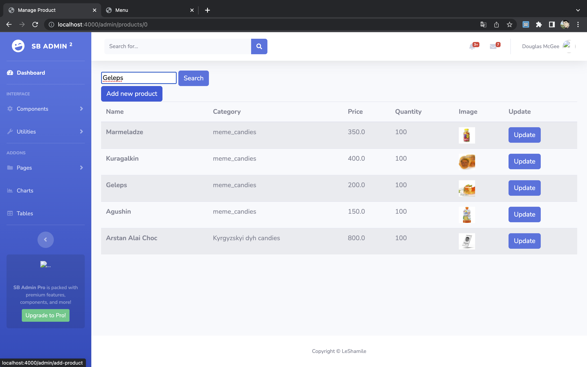
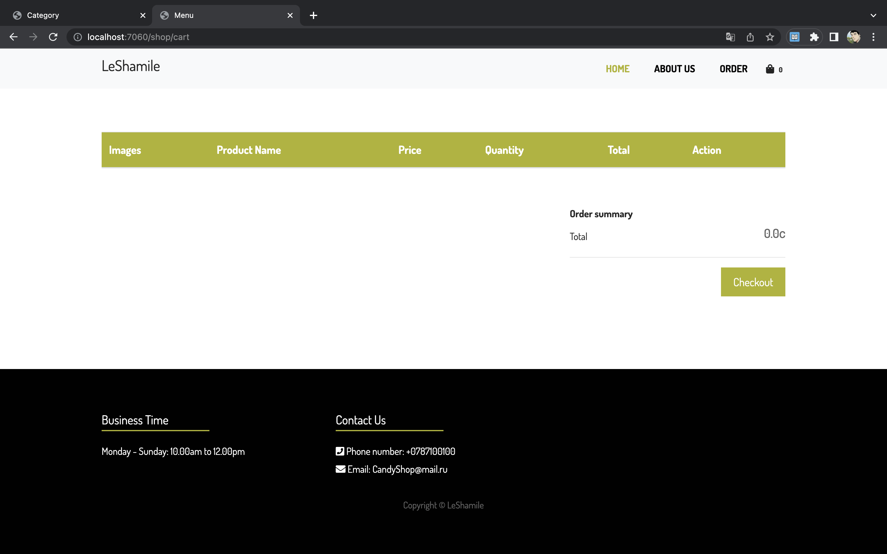

<h1><b>Order Page</b></h1>

<h3>Order Page was done by video lessons from You-Tube chanel 
<b>self-code</b></h3>

 
 
<h2>Link for my <a href="https://youtu.be/ymYMdRn8YYM">video </a>(YouTube)</h2>
 
 

My shop called <b>LeShamile</b> and it CandyShop. It has part for admin and for customers.

<h3><b>Admin</b></h3>
It's page where you need to register and log in

http://localhost:4000/admin/login

1) Registration

Also will show mistake if email already exist

<b>DATABASE</b>

2) Log in

3) After authorization you will see index page (i used template from themewagon (SB Admin 2))

by clicking Components and after Manage Category you will see <b>categories page</b>

4) 
Here you can add new categories that will be seen to customers

Also you can enable and delete categories it won't be seen in add product, but will be seen in shop.
So better use <b>UPDATE</b>

<b>DATABASE</b>

Next click <b>Components</b> and go to <b>Manage Product</b>

5) 
   <b>Here you can</b>

Add new product (don't forget to add a picture)

(don't forget to add a picture)

Also product section have <b>Search function</b>

DATABASE

<h3>Shop</h3>
So this shop part. It also have register and log in part

http://localhost:7060/shop/register

1) Registration

2) Log in

DATABASE

3) You will see <b>about us</b> page

footer

Click on HOME

4) Here you can see all products that you added in Admin part

Then mouse over the product and you will see <b>Add cart</b> button 

Click on it and after that click on pocket

5) You will see <b>cart page</b>

In cart you can:

You can change quantity of products

Don't forget to click on update button

And delete everything

Click on <b>Checkout</b>

1)  It will open page where you need to fill more information. Without filling it you couldn't place order

Click on <b>Save</b> button and it will be saved on Database

Go again to cart
7) Click <b>Checkout</b>

8) You will see <b>check-out</b> page with all information

Also if filled information about you once, you don't need to do this on other orders

9) You order confirmed

DATABASE

You can see all orders even from others accounts and don't forget that price in Database is without delivery price

<h2>Thank you for attention</h2>

